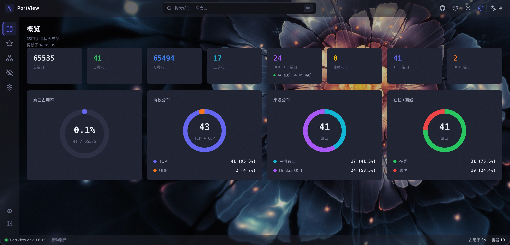
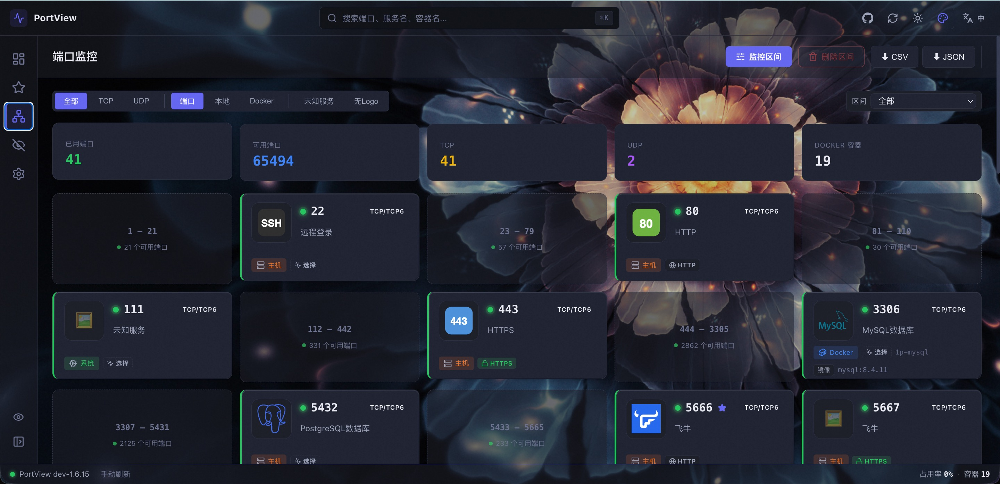
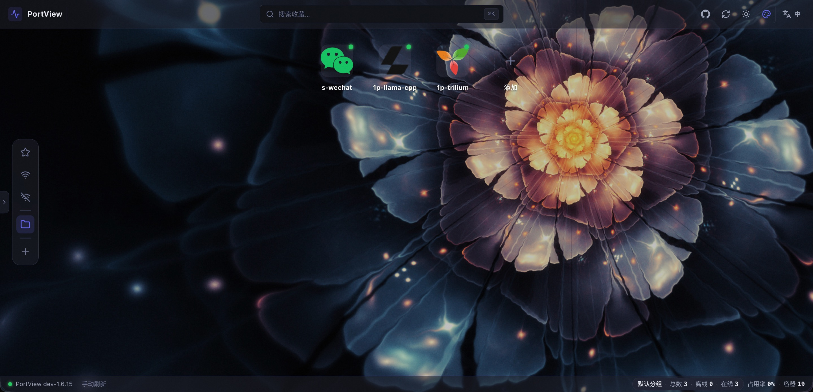
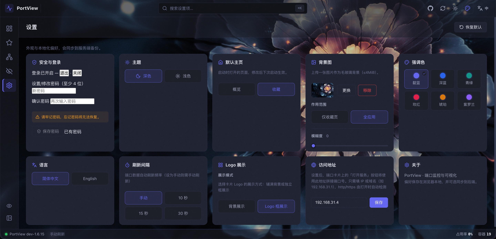

# PortView

> Port monitoring & visualization — turns Docker container and host ports into cards you can read at a glance.

[English](README.md) | [简体中文](README.zh-CN.md)

PortView runs on a NAS or server, reads **Docker container port mappings** and **local listening ports** in real time, and renders them as visual cards. It supports multi-range filtering, quick search, port hiding, logo management, favorites, and optional password login.


---

## Features

**Port monitoring**
- **Docker ports** — reads port mappings from all containers (including stopped ones)
- **Host ports** — detects local listening ports
- **Offline containers** — stopped containers' mappings are still shown; online / offline at a glance
- **Overview stats** — occupancy rate, protocol / source / online-offline distribution charts

**Organize & filter**
- **Multi-range monitoring** — define any port ranges (e.g. 80s / 8000s) and view only what matters
- **Quick filters** — one-click "unknown service" and "no logo" filters
- **Quick search** — `⌘K` global search across port, service name, container name
- **Port hiding** — hide ports you don't care about, managed on a dedicated page
- **Favorites** — favorite ports or custom URLs, organize into folders, drag to arrange

**Card capabilities**
- **Logo management** — auto-discover or upload; "full background" or "logo box" display modes
- **Service protocol** — HTTP / HTTPS detection & manual override, one-click "open service"
- **Service naming** — name unknown services; multiple ports of the same image auto-group
- **Export** — export port data to CSV / JSON

**Experience**
- **Themes** — dark / light + 6 accent colors
- **Background image** — custom frosted-glass background (favorites page / whole app)
- **Login protection** — optional single-user password (argon2id), for public exposure
- **i18n** — English / 简体中文

## Screenshots

### Overview


### Ports


### Favorites


### Settings


## Quick Start

### Option 1: Docker Compose (recommended)

```bash
git clone https://github.com/GivanGu/PortView.git portview
cd portview
docker compose up -d
```

Listens on `8081` by default. Visit `http://<host>:8081`.

### Option 2: Standalone compose file (no repo needed)

Create a `docker-compose.yml` in any directory (e.g. `~/portview/`) with the content below, then `docker compose up -d`:

```yaml
services:
  portview:
    # ACR (China) by default; to use GHCR, comment the line above and uncomment the next
    image: crpi-bywv2frq7uqt57e1.cn-hangzhou.personal.cr.aliyuncs.com/selfwarehouse/portview:latest
    # image: ghcr.io/givangu/portview:latest
    container_name: portview
    network_mode: host
    extra_hosts:
      - "host.docker.internal:host-gateway"
    volumes:
      - /var/run/docker.sock:/var/run/docker.sock:ro
      - ./config:/app/config
    environment:
      - PORTVIEW_PORT=8081
    restart: unless-stopped
```

```bash
docker compose up -d          # start
docker compose logs -f        # follow logs
```

> `./config` is auto-created on first start and holds the single SQLite DB. Change `PORTVIEW_PORT` if `8081` is taken.

### Option 3: Pull the image

```bash
# GHCR
docker pull ghcr.io/givangu/portview:latest

# or ACR (China)
docker pull crpi-bywv2frq7uqt57e1.cn-hangzhou.personal.cr.aliyuncs.com/selfwarehouse/portview:latest

docker run -d --name portview \
  --network host \
  -v /var/run/docker.sock:/var/run/docker.sock:ro \
  -v ./config:/app/config \
  -e PORTVIEW_PORT=8081 \
  ghcr.io/givangu/portview:latest
```

> Bind-mount `config/` to persist all data (password, ranges, port labels, hidden ports, login state) — everything lives in the single `config/portview.db`.

### Local development

See [AGENTS.md](AGENTS.md) for the contributor / local dev workflow.

## License

MIT
